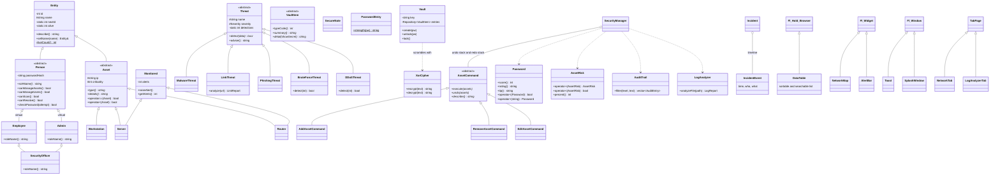

# UML Class Diagram

Paste into any Mermaid viewer (GitHub, VS Code Mermaid preview, mermaid.live).

## Core classes and inheritance

```mermaid
classDiagram
    direction TB

    class Entity {
        -int id
        #string name
        -static int nextId
        -static int alive
        +describe() string
        +setName(name) Entity&
        +liveCount()$ int
    }

    class Person {
        <<abstract>>
        -string passwordHash
        +roleName() string*
        +canManageAssets() bool
        +canManageUsers() bool
        +canScan() bool
        +canResolve() bool
        +checkPassword(attempt) bool
    }
    class Employee { +roleName() string }
    class Admin { +roleName() string }
    class SecurityOfficer { +roleName() string }

    Entity <|-- Person
    Person <|-- Employee : virtual
    Person <|-- Admin : virtual
    Employee <|-- SecurityOfficer
    Admin <|-- SecurityOfficer

    class Asset {
        <<abstract>>
        #string ip
        #int criticality
        +type() string*
        +details() string*
        +operator==(Asset) bool
        +operator<(Asset) bool
    }
    class Monitored {
        -int alerts
        +raiseAlert()
        +getAlerts() int
    }
    class Workstation
    class Server
    class Router

    Entity <|-- Asset
    Asset <|-- Workstation
    Asset <|-- Server
    Asset <|-- Router
    Monitored <|-- Server
    Monitored <|-- Router

    class Threat {
        <<abstract>>
        #string name
        #Severity severity
        -static int detections
        +detect(data) bool*
        +advice() string
    }
    class MalwareThreat
    class LinkThreat { +analyze(url) LinkReport }
    class PhishingThreat
    class BruteForceThreat { +detect(int) bool }
    class DDoSThreat { +detect(int) bool }

    Threat <|-- MalwareThreat
    Threat <|-- PhishingThreat
    Threat <|-- BruteForceThreat
    Threat <|-- DDoSThreat
    Threat <|-- LinkThreat

    class VaultItem {
        <<abstract>>
        +typeCode() int*
        +summary() string*
        +detail(showSecret) string*
    }
    class SecureNote
    class PasswordEntry { +strength(pw)$ string }
    class Vault {
        -string key
        -Repository~VaultItem~ entries
        +create(pw)
        +unlock(pw)
        +lock()
    }
    class XorCipher { +encrypt(text) string
        +decrypt(text) string }
    Vault ..> XorCipher : scrambles with

    class AssetCommand {
        <<abstract>>
        +execute(assets)*
        +undo(assets)*
        +describe() string*
    }
    class AddAssetCommand
    class RemoveAssetCommand
    class EditAssetCommand
    AssetCommand <|-- AddAssetCommand
    AssetCommand <|-- RemoveAssetCommand
    AssetCommand <|-- EditAssetCommand
    SecurityManager o-- AssetCommand : undo stack and redo stack

    class Password {
        +score() int
        +rating() string
        +tip() string
        +operator<(Password) bool
        +operator+(string) Password
    }
    class AssetRisk {
        +operator+(AssetRisk) AssetRisk
        +operator<(AssetRisk) bool
        +percent() int
    }
    class AuditTrail { +filter(level, text) vector~AuditEntry~ }
    class LogAnalyzer { +analyzeFile(path) LogReport }
    class IncidentEvent { time, who, what }
    Incident o-- IncidentEvent : timeline
    SecurityManager ..> Password
    SecurityManager ..> AssetRisk
    SecurityManager ..> AuditTrail
    SecurityManager ..> LogAnalyzer

    class DataTable { sortable and searchable list }
    Fl_Hold_Browser <|-- DataTable
    Fl_Widget <|-- NetworkMap
    Fl_Widget <|-- AlertBar
    Fl_Window <|-- Toast
    Fl_Window <|-- SplashWindow
    TabPage <|-- NetworkTab
    TabPage <|-- LogAnalyzerTab
```
